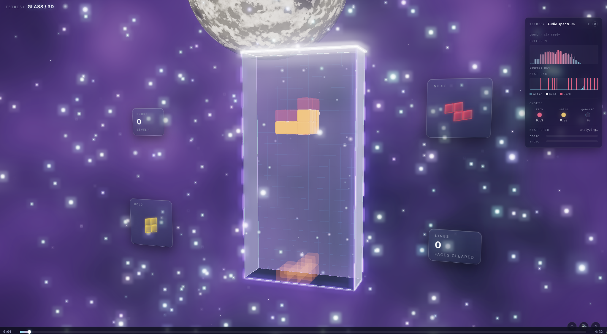

# TetrisPlus

3D glass-voxel Tetris with music-reactive VFX and online versus.

🎮 **Play it:** [tetraplus.app](https://tetraplus.app)



## What it is

A web-native take on Tetris where the playfield is a glass case in 3D space, blocks have physical weight (Rapier rigid bodies on lock + clear), and the VFX react to the beat and frequency content of whatever's playing. Solo or 1v1 over a Cloudflare Worker relay.

## Features

- **3D glass aesthetic** — physically-based glass shader on the case and pieces, bloom + chromatic post chain, configurable depth/IOR/roughness from the in-game settings panel.
- **Music-reactive VFX** — real-time BPM detection ([`web-audio-beat-detector`](https://github.com/chrisguttandin/web-audio-beat-detector)) + spectral features ([Meyda](https://meyda.js.org/)) drive emitter intensity, camera pulse, and stage visualizers.
- **Physics on clear** — cleared lines shatter into Rapier-simulated shards instead of just disappearing.
- **Online versus** — lobby-code matchmaking through a WebSocket relay, deterministic RNG + input replay for rollback consistency.
- **Mobile + desktop** — touch controls, wheel-zoom, liquid-glass HUD panels; works on phones.
- **Two-player on one keyboard** — P1 arrows / P2 WASD for couch play.

## Tech stack

| Layer | Tech |
|---|---|
| Rendering | [Three.js](https://threejs.org/) `0.160`, custom GLSL, post-processing |
| Physics | [Rapier3D](https://rapier.rs/) (WASM) |
| Audio | Web Audio API, Meyda, `web-audio-beat-detector`, `realtime-bpm-analyzer` |
| Animation | GSAP |
| Build | Vite |
| Multiplayer | WebSocket relay (Cloudflare Worker, separate deploy under `project/server/relay/`) |
| Hosting | Cloudflare Workers static assets + edge worker for `www → apex` redirect |
| Tests | Vitest |

## Quick start

```bash
cd project
pnpm install
pnpm dev          # http://localhost:5173
pnpm test         # vitest
pnpm build        # → project/dist/
pnpm relay        # local WS relay for online-versus dev
```

Requires Node 18+.

## Controls

| Action | Player 1 | Player 2 |
|---|---|---|
| Move left / right | `←` `→` | `A` `D` |
| Soft drop | `↓` | `S` |
| Hard drop | `Space` | `Q` |
| Rotate CW | `↑` / `X` | `W` |
| Rotate CCW | `Z` | `E` |
| Hold | `C` / `LShift` | `RShift` |

Open the **⚙ Settings** panel (in-game CSS3D overlay) to tweak glass material, VFX intensity, camera, and audio reactivity live.

## Architecture

Strictly layered subsystems with one-way dependencies, enforced via ESLint `no-restricted-imports`:

```
app/        ← composition root
  ├─ engine/      game-agnostic primitives (clock, event bus, RNG)
  ├─ gameplay/    pure simulation (no Three, no DOM)
  ├─ input/       keyboard/touch → intents
  ├─ rendering/   renderer, frame graph, post
  ├─ world/       glass case, board view, environment
  ├─ camera/      rig, orbit, shake
  ├─ materials/   glass / core / sparkle / shard factories
  ├─ shaders/     raw GLSL (leaf)
  ├─ vfx/         director, emitters, reactive bindings
  ├─ audio/       playback + reactive analysis
  ├─ physics/     Rapier integration
  ├─ net/         protocol, transports, rollback
  ├─ ui/          HUD, menus, info panel
  └─ config/      live tweaks + persistence
```

Hard rules:

1. `gameplay/` has no graphics. No `three`, no DOM.
2. Events flow up, snapshots flow down.
3. One owner per piece of state.
4. One clock, many subscribers — no subsystem starts its own `requestAnimationFrame`.

See [`project/src/README.md`](project/src/README.md) for the full module table, and [`document/plan_v3.md`](document/plan_v3.md) for the architecture rationale.

## Repo layout

```
.
├── project/           # the app
│   ├── src/           # source (see Architecture)
│   ├── server/relay/  # WebSocket relay Worker (separate deploy)
│   ├── tetris.html    # entry HTML
│   └── vite.config.js
├── document/          # architecture + planning notes
├── worker.js          # frontend edge worker (www → apex redirect)
└── wrangler.toml      # Cloudflare deploy config
```

## Deployment

The frontend is a Vite build served from Cloudflare's static-asset CDN, fronted by [`worker.js`](worker.js) for the `www → apex` 301. The multiplayer relay is a separate Worker under [`project/server/relay/`](project/server/relay/) with its own `wrangler.toml`. See [`wrangler.toml`](wrangler.toml) for the build pipeline.

## License

[MIT](LICENSE) © 2026 Clinton Gao
